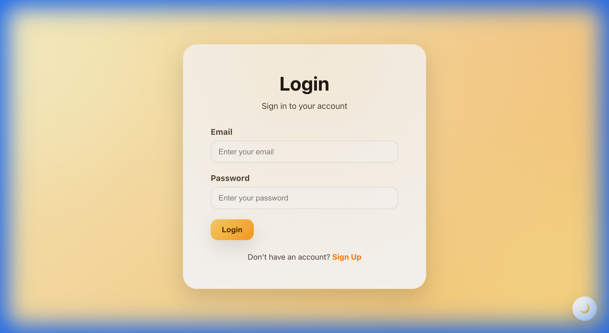
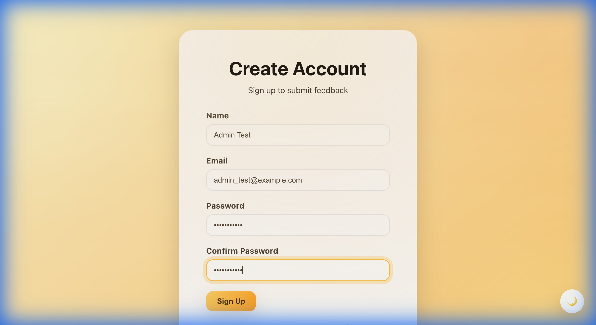
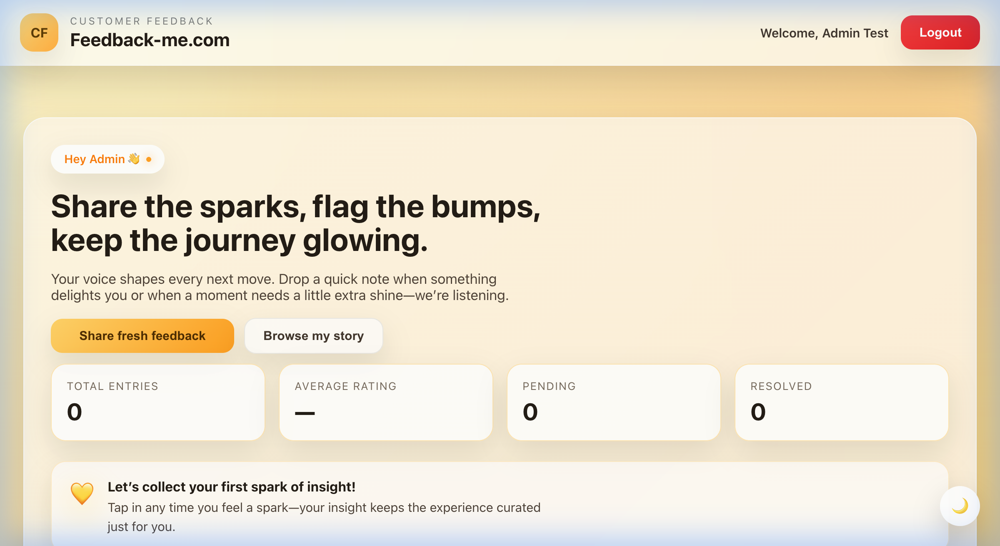
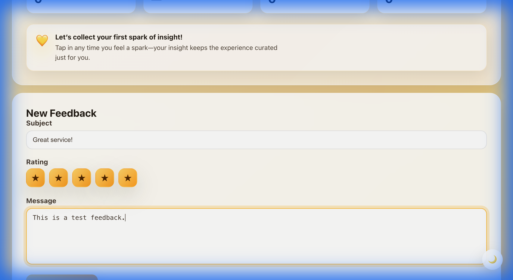
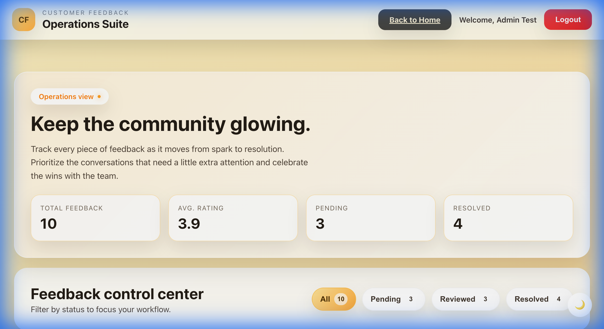
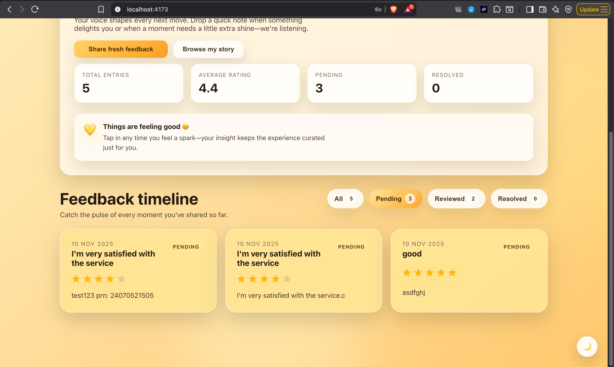
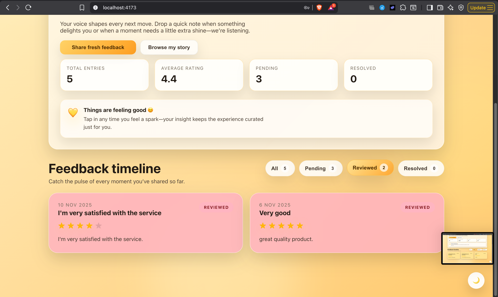
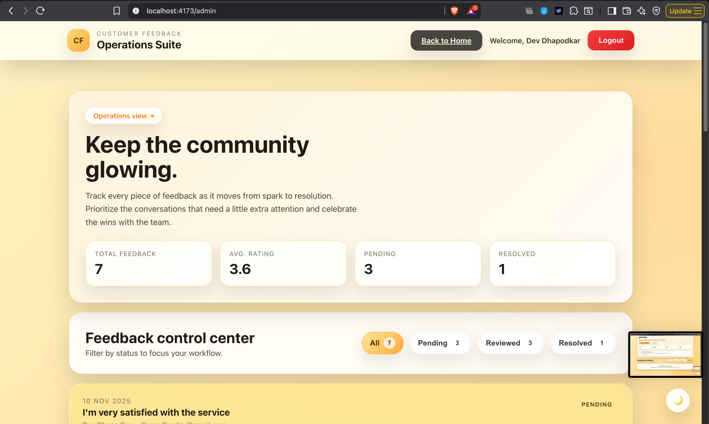
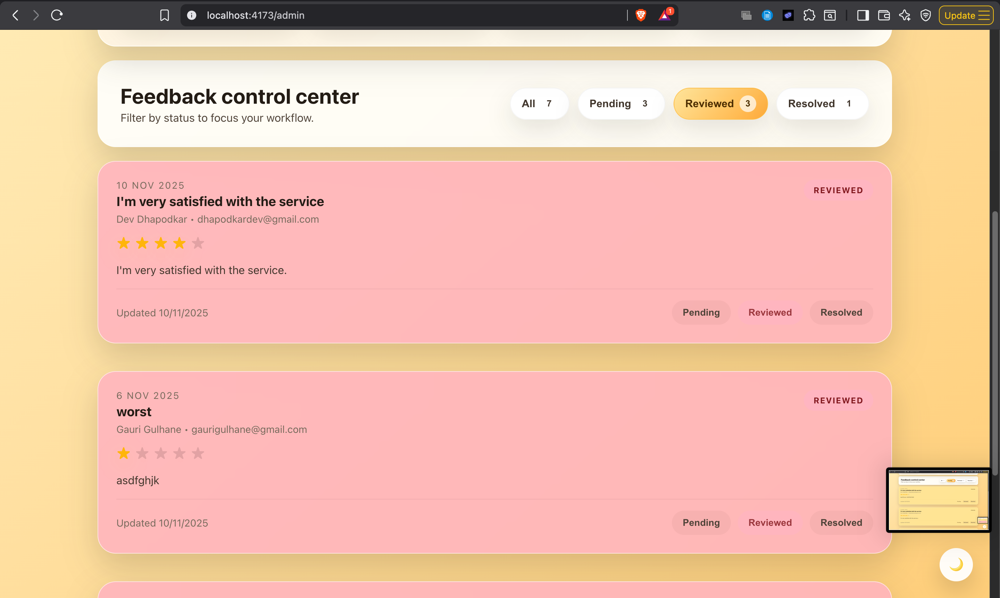

# Customer Feedback Portal

A full‑stack web application for collecting and managing customer feedback. Built with React (Vite), Node.js, Express, and MongoDB. This document includes complete setup and configuration steps for college submission.

## Features

- **User Authentication**: Sign up and login with JWT-based authentication
- **Feedback Submission**: Users can submit feedback with rating and detailed message
- **Feedback Management**: Users can view their own feedback
- **Admin Dashboard**: Admins can view all feedback and update status
- **Modern UI**: Responsive, SPA UX with protected routes

## Tech Stack

### Frontend
- React 18 (Vite)
- React Router DOM
- Axios
- CSS

### Backend
- Node.js + Express.js
- MongoDB (Mongoose)
- JWT (JSON Web Tokens)
- bcryptjs (password hashing)

## Project Structure

```
customer-feedback-portal/
│
├── backend/
│   ├── package.json
│   ├── server.js
│   ├── config/
│   │   └── db.js                 # Database connection
│   ├── controllers/
│   │   ├── authController.js
│   │   └── feedbackController.js
│   ├── middleware/
│   │   └── authMiddleware.js     # JWT guard + admin guard
│   ├── models/
│   │   ├── User.js
│   │   └── Feedback.js
│   ├── routes/
│   │   ├── authRoutes.js
│   │   └── feedbackRoutes.js
│   ├── scripts/
│   │   ├── inspectDb.js          # Utility to inspect Mongo
│   │   └── promoteAdmin.js       # Promote an existing user to admin
│   └── utils/
│       └── generateToken.js
│
├── frontend/
│   ├── package.json
│   ├── vite.config.js
│   ├── src/
│   │   ├── main.jsx
│   │   ├── App.jsx
│   │   ├── components/
│   │   │   ├── ErrorBoundary.jsx
│   │   │   └── ProtectedRoute.jsx
│   │   ├── context/
│   │   │   └── AuthContext.jsx
│   │   ├── pages/
│   │   │   ├── Signup.jsx
│   │   │   ├── Login.jsx
│   │   │   ├── Home.jsx
│   │   │   └── Admin.jsx
│   │   └── services/
│   │       └── api.js            # Axios instance (baseURL: /api)
│   └── public/
│       └── index.html
│
├── docker-compose.mongo-express.yml # Optional MongoDB web UI (mongo-express)
└── README.md
```

## Quick Start

### Prerequisites
- Node.js 18+
- MongoDB running locally (or Atlas connection string)
- npm (or yarn)

### Environment Configuration

Create `backend/.env` with:
```env
# Match Vite dev proxy (see frontend/vite.config.js)
PORT=5001

# Local Mongo or Atlas URI
MONGODB_URI=mongodb://127.0.0.1:27017/customer-feedback-portal

# Use a strong, unique value in real deployments
JWT_SECRET=change-me-in-production

NODE_ENV=development
```

Optional `frontend/.env` (only needed if you disable the Vite proxy):
```env
# Example only; not required when using /api proxy
VITE_API_BASE_URL=http://localhost:5001/api
```

### Install and Run (Dev)

Backend:
```bash
cd backend
npm install
npm run dev
# Runs on http://localhost:5001 (from PORT)
```

Frontend (in a new terminal):
```bash
cd frontend
npm install
npm run dev
# Opens http://localhost:3000 and proxies /api to http://localhost:5001
```

Health check: `GET http://localhost:5001/api/health`

### Build for Production

Frontend production build:
```bash
cd frontend
npm run build
```

The backend is already configured to serve the built SPA from `frontend/dist` when running in production. Start the server normally:
```bash
cd backend
npm start
```

## Admin Setup

Promote an existing user to admin using the script:
```bash
cd backend
# After the user has signed up with email you specify below
npm run promote-admin -- admin@example.com
```

Alternatively, update directly in Mongo:
```javascript
db.users.updateOne(
  { email: "admin@example.com" },
  { $set: { role: "admin" } }
)
```

## Optional: Mongo Express (DB UI)

A convenience `docker-compose.mongo-express.yml` is provided to inspect your local MongoDB via a browser UI.

```bash
docker compose -f docker-compose.mongo-express.yml up -d
# Visit http://localhost:8081 (user: admin / pass: admin)
```

Note: This compose file assumes MongoDB is already running on your host at `127.0.0.1:27017`.

## API Endpoints

### Authentication
- `POST /api/auth/signup` — Register a new user
- `POST /api/auth/login` — Login user

### Feedback (Protected)
- `POST /api/feedback` — Create new feedback
- `GET /api/feedback/my-feedback` — Get the authenticated user's feedback
- `GET /api/feedback/:id` — Get feedback by ID
- `GET /api/feedback` — Get all feedback (Admin only)
- `PUT /api/feedback/:id/status` — Update feedback status (Admin only)

### Health
- `GET /api/health` — Server status

## Usage Flow

1. Sign up with name, email, password
2. Login to obtain JWT (stored automatically by the app)
3. Submit feedback (rating + message)
4. View your submitted feedback in Home
5. Promote your account to admin (optional) and manage all feedback in Admin

## Notes on Configuration

- Dev proxy: `frontend/vite.config.js` proxies `/api` to `http://localhost:5001`. Ensure your backend `PORT=5001` for a plug‑and‑play dev setup. If you prefer a different port, update either the `.env` or the proxy target accordingly.
- Axios base URL: Frontend uses relative `baseURL: '/api'` so it works in both dev (via proxy) and prod (same origin) without changes.

## Troubleshooting

- **Cannot login / 401 repeatedly**: Your token may have expired or is missing. Try logging out and back in. Ensure `JWT_SECRET` is set and consistent.
- **API requests failing in dev**: Confirm backend is on `http://localhost:5001` and Vite dev server shows the proxy. If not, align `PORT` or adjust `frontend/vite.config.js` proxy target.
- **Mongo connection error**: Verify `MONGODB_URI` and that MongoDB is running. For Atlas, ensure IP access is allowed and the URI includes credentials and the database name.
- **Blank page in production**: Ensure you built the frontend (`npm run build` in `frontend`) and are serving the `frontend/dist` folder via the backend (`npm start` in `backend`).

## Security Features

- Password hashing with bcrypt
- JWT token-based authentication
- Protected routes via middleware
- Role-based (admin) authorization for sensitive endpoints

## Submission Info (College)

- Title: Customer Feedback Portal
- Objective: Build a full‑stack CRUD app with authentication and role‑based admin features
- Technologies: React (Vite), Node.js, Express, MongoDB (Mongoose), JWT, Axios
- How to run: See Quick Start and Environment Configuration
- Screens/Flows: Signup, Login, Home (user feedback list & submission), Admin (manage all feedback)

## UI Screenshots and Descriptions

### Login Page



The login page features a dark-themed login form centered on a blurred, dark gradient background. The form is contained within a rounded rectangular card, presenting fields for email and password, a vibrant orange login button, and a sign-up link. The background transitions from darker tones to a warm brown/orange hue, creating a soft ambient glow. A theme toggle button is visible in the bottom right corner.

**UI Explanation:**
- **Design Philosophy:** The login page uses a Bumble-inspired aesthetic with warm, inviting colors and smooth gradients
- **User Experience:** The centered card design focuses user attention on the login form, while the blurred background creates depth
- **Interactive Elements:** 
  - Input fields have rounded corners and smooth focus transitions
  - The orange "Login" button uses a gradient that responds to hover with elevation effects
  - The sign-up link is prominently highlighted in orange to encourage new user registration
- **Accessibility:** Clear labels, sufficient contrast, and intuitive form layout ensure easy navigation

**Key Elements:**
- Dark gray input fields with rounded corners
- Orange "Login" button with white text
- "Don't have an account? Sign Up" link with orange highlight
- Clean, modern design with subtle shadows

### Signup Page



The signup page displays a "Create Account" form within a dark, rounded rectangular card. The form includes four input fields: Name, Email, Password, and Confirm Password, each with clear labels and placeholder text. A vibrant orange "Sign Up" button is positioned below the fields, and a login link is available at the bottom. The page maintains the same dark theme aesthetic as the login page.

**UI Explanation:**
- **Design Consistency:** The signup page maintains the same visual language as the login page, creating a cohesive user experience
- **Form Design:** Four input fields are clearly labeled with helpful placeholder text and validation hints
- **User Flow:** The password field includes a minimum character requirement hint to guide users, and the confirm password field ensures data accuracy
- **Navigation:** A login link at the bottom allows existing users to quickly navigate to the login page
- **Visual Feedback:** Input fields have focus states with orange borders and subtle glow effects

**Key Elements:**
- Four input fields with dark gray backgrounds
- Password field includes minimum character requirement hint
- Orange "Sign Up" button
- "Already have an account? Login" link

### Home Page (Dark Mode)



The home page in dark mode features a comprehensive dashboard with a top navigation bar, hero section, statistics dashboard, motivational message, and feedback timeline. The design uses a dark gray/black color scheme with yellow/orange accents.

**UI Explanation:**
- **Navigation Design:** The top navigation bar features a yellow "CF" icon with the brand name "Feedback-me.com", creating strong brand recognition. User greeting and action buttons are positioned on the right for easy access.
- **Hero Section:** The hero section uses friendly, conversational language ("Hey Dev 👋") to create a personal connection. The headline uses playful, rhyming language that matches the Bumble-inspired aesthetic.
- **Statistics Dashboard:** Four stat cards provide at-a-glance feedback metrics, helping users understand their feedback history quickly. The cards use a grid layout for easy scanning.
- **Motivational Elements:** A "Vibes are glowing ✨" message with a yellow heart icon adds personality and encourages continued engagement.
- **Feedback Timeline:** Filter pills allow users to quickly filter their feedback by status, while feedback cards display in a grid layout for efficient browsing.

**Key Features:**
- **Navigation Bar:** Yellow "CF" icon, "CUSTOMER FEEDBACK" label, "Feedback-me.com" brand name, user greeting, "Admin Panel" and "Logout" buttons
- **Hero Section:** "Hey Dev 👋" badge, headline "Share the sparks, flag the bumps, keep the journey glowing", action buttons "Share fresh feedback" and "Browse my story"
- **Statistics Dashboard:** Four cards showing Total Entries (2), Average Rating (5.0), Pending (1), and Resolved (0)
- **Motivational Message:** Yellow heart icon with "Vibes are glowing ✨" message
- **Feedback Timeline:** Filter pills (All, Pending, Reviewed, Resolved) and feedback cards displayed side-by-side

### Home Page (Light Mode)


The light mode version maintains the same structure but with a warm, light color scheme. The background transitions from light beige/yellow to cream, with orange and yellow accents for interactive elements.

**UI Explanation:**
- **Theme Consistency:** The light mode maintains the same layout and functionality as dark mode, ensuring a consistent user experience across themes
- **Color Psychology:** The warm yellow/orange color palette creates an optimistic, friendly atmosphere that encourages user engagement
- **Visual Hierarchy:** White cards on a warm background create clear visual separation and focus attention on content
- **Accessibility:** Light mode provides high contrast for users who prefer brighter interfaces or work in well-lit environments
- **Theme Toggle:** Users can easily switch between light and dark modes using the theme toggle button

**Key Features:**
- Light beige/yellow header with orange "CF" avatar
- Off-white hero card with rounded corners
- Four statistics cards with white backgrounds
- Warm orange/yellow color palette throughout
- Clean, modern design with soft shadows

### Feedback Submission Form



The feedback submission form is displayed in a prominent white card with rounded corners. It includes:
- **Subject Field:** Pre-filled with "I'm very satisfied with the service"
- **Rating Section:** Five star icons with four filled (4-star rating)
- **Message Field:** Large text area for detailed feedback
- **Submit Button:** Orange-yellow "Submit Feedback" button

**UI Explanation:**
- **Form Design:** The form uses a clean, card-based layout that focuses user attention on the feedback submission process
- **Interactive Rating:** The star rating system uses clickable stars that fill with color, providing immediate visual feedback
- **User Guidance:** Clear labels and placeholder text guide users through the submission process
- **Visual Feedback:** The submit button uses a gradient that responds to hover, providing clear interactive feedback
- **Accessibility:** Form fields have clear focus states and sufficient contrast for easy navigation

The form appears below the "Vibes are glowing" banner and above the feedback timeline section.

### Admin Panel - Operations Suite



The admin panel features a comprehensive operations dashboard with a clean, modern design using a light color scheme with warm orange and yellow accents.

**UI Explanation:**
- **Dashboard Design:** The admin panel provides a comprehensive overview of all feedback with key statistics at a glance
- **Hero Section:** The "Operations view" badge and motivational headline create a professional yet friendly atmosphere
- **Statistics Cards:** Four stat cards display total feedback, average rating, pending, and resolved counts, helping admins quickly assess the feedback landscape
- **Filter System:** Filter pills allow admins to quickly filter feedback by status, improving workflow efficiency
- **Single-Column Layout:** The single-column layout ensures all feedback information is clearly visible and accessible

**Key Sections:**
- **Hero Section:** "Operations view" badge, headline "Keep the community glowing", descriptive text, and four statistics cards (Total Feedback: 6, Avg. Rating: 3.5, Pending: 2, Resolved: 1)
- **Feedback Control Center:** Title with subtitle "Filter by status to focus your workflow", four filter pills (All, Pending, Reviewed, Resolved)
- **Feedback List:** Single-column layout with individual feedback cards, each containing:
  - Date and subject
  - User name and email
  - Star rating
  - Feedback message
  - Update timestamp
  - Three interactive status pills (Pending, Reviewed, Resolved) at the bottom right
  - Status badge in the top right corner

### Admin Panel - Feedback Cards Detail



This view showcases the detailed feedback cards in the admin panel, demonstrating the single-column layout where each card spans the full width of the content area.

**UI Explanation:**
- **Card Design:** Each feedback card uses a clean, card-based layout with rounded corners and subtle shadows for depth
- **Information Hierarchy:** The date is displayed at the top left, followed by the subject/title, user information, and rating
- **Status Management:** Three interactive status pills (Pending, Reviewed, Resolved) at the bottom right allow admins to quickly update feedback status with a single click
- **Visual Feedback:** Status pills change color when active, providing clear visual feedback about the current status
- **Color Coding:** Different background colors (pink for reviewed, yellow for pending) help admins quickly identify feedback status at a glance
- **Single-Column Layout:** The single-column layout ensures all elements, including the status pills, are fully contained within each card and easily accessible

**Card Features:**
- Light pink or yellow backgrounds with rounded corners
- Date displayed at the top left
- Bold subject/title
- User information (name and email)
- Star rating visualization
- Detailed feedback message
- "Updated" timestamp at the bottom left
- Three interactive status pills at the bottom right (Pending, Reviewed, Resolved)
- Status badge in the top right corner (PENDING, REVIEWED, or RESOLVED)

The single-column layout ensures all elements, including the status pills, are fully contained within each card and easily accessible.

### Additional UI Views



The feedback timeline view shows filtered feedback cards with status indicators and interactive elements.


The admin panel with active filters showing filtered feedback entries based on selected status.



Different feedback card states showing various status badges and color coding for easy identification.


The admin operations view with statistics dashboard and feedback management interface.


The user feedback dashboard showing personal feedback history and statistics.



The status management interface showing interactive status pills and feedback details.


A complete view of the admin panel showing all feedback entries with full details and management options.

### Design Highlights

**Color Scheme:**
- **Light Mode:** Warm yellows, creams, and oranges with white cards
- **Dark Mode:** Dark grays and blacks with yellow/orange accents
- **Status Colors:** Yellow (Pending), Pink (Reviewed), Green (Resolved)

**Interactive Elements:**
- Rounded corners on all cards and buttons
- Smooth hover effects and transitions
- Pill-shaped filter and status buttons
- Star ratings with visual feedback
- Theme toggle for light/dark mode switching

**Layout:**
- Responsive single-column layout for feedback cards
- Grid layout for statistics dashboard
- Clean spacing and typography
- Modern, Bumble-inspired aesthetic

## License

This project is created for educational purposes.
